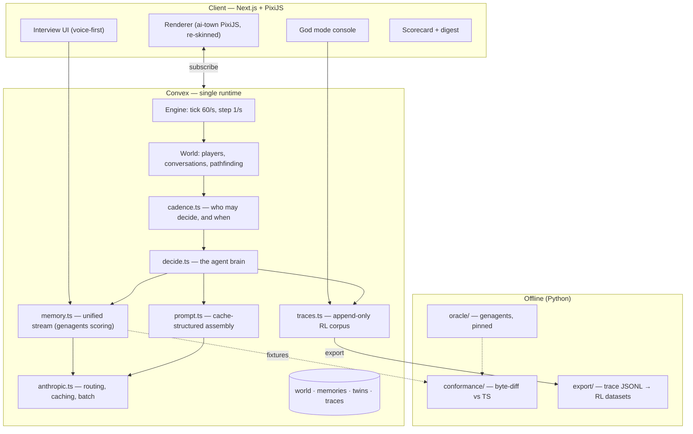

# Gatherville — Technical Architecture

**Status:** v2, 2026-08-05. Supersedes v1 (which specified a Python behavior service, a two-store memory split, and bounded episodes — all three replaced).

**Companion docs:** [`FIDELITY.md`](./FIDELITY.md) — what we copy from `genagents` and what we deviate on. [`GENAGENTS-ANALYSIS.md`](./GENAGENTS-ANALYSIS.md) — line-by-line read of the reference implementation, including the bugs and the scale conflict.

---

## 1. Product thesis

**Answer questions for seven minutes, then watch a pixel-art version of yourself live its life and find out how well it predicts you.**

Three things make it work as a consumer product:

1. **The onboarding is the product.** The interview isn't a form in front of the game — it's the interesting part, because it produces something that acts like you.
2. **There is a score.** Holdout questions the twin never saw, answered by the twin, scored against you. Honest, shareable, and a reason to come back.
3. **It's always running.** Your twin has a life whether or not you're watching. Coming back to "here's what you did while you were gone" is the retention loop.

The long-term asset is the behavioral corpus and the RL signal on top of it. That only holds if consent (§9) and trace fidelity (§7) are built in from the start.

---

## 2. Four decisions that shape everything

| # | Decision | Consequence |
|---|---|---|
| 1 | **TypeScript runtime; no Python service** | `genagents` is a reference, not a dependency. Its ~920 lines are ported. Python survives only in `training/` as a conformance oracle and dataset builder. No HTTP seam, no second deployment. |
| 2 | **One reconciled memory stream** | Single table, `provenance`-tagged. Importance on a single 0–100 scale. No identity/episodic split. |
| 3 | **24/7 simulation** | Continuity is free; **decisions** are what cost money. Cadence — not uptime — is the cost dial. |
| 4 | **God mode** | Human interventions are first-class trace rows linked to the decision they replaced, i.e. preference pairs for RL. |

---

## 3. System overview



Everything in the request path is one language and one deployment. Python is offline only.

---

## 4. The brain (`decide.ts`, `memory.ts`, `prompt.ts`)

### Memory — one stream

Single `memories` table (`convex/gatherville/schema.ts`), every row carrying `provenance`:

| Provenance | Source |
|---|---|
| `interview` | stated by the real user at onboarding |
| `simulated` | happened to the twin in-world |
| `reflection` | model-derived higher-order belief |
| `intervention` | a human corrected the twin — the strongest signal we get |
| `seed` | synthetic GSS-derived population NPC (**declared but not yet implemented** — see below) |

This is not bookkeeping. It's what separates what a human said from what a model invented while playing them — and losing it poisons both the twin and anything trained on the corpus.

> **On the GSS agent bank.** genagents ships 3,505 demographic agents, but they
> carry `scratch.json` **only** — `nodes.json` is literally `[]` and
> `embeddings.json` is `{}`. They are demographic shells (name, age, sex,
> ethnicity, address, political views), not agents with memory streams. Using them
> as population NPCs is still possible, but each would retrieve nothing and its
> description would collapse to `str(scratch)`. The `seed` provenance value exists
> for them; no loader is implemented. Only `single_agent/` has a real stream
> (116 nodes, 1536-dim embeddings).

**Importance is 0–100**, matching genagents. ai-town's 0–9 scorer is rescaled. Mixing scales would silently rank every ai-town memory below every genagents memory forever (see `GENAGENTS-ANALYSIS.md` §2.1).

### Retrieval — faithful to genagents

```
score = 0.0 · recency + 1.0 · relevance + 0.5 · importance
```

matching `hp=[0, 1, 0.5]`. Each component normalized to `[0,1]` across the candidate set *before* weighting; results returned in ascending `created` order. Recency is implemented but inert by default, exactly as upstream.

Known consequences, both from the line-by-line read:

- **Cold start is degenerate.** Upstream normalization maps a zero-range component to a flat `0.5`, so a twin with few (or uniformly-scored) memories retrieves near-arbitrarily. Guard: don't surface twin output below a minimum distinct-memory count.
- **Vector prefiltering is a deviation.** genagents scores relevance over the entire stream; Convex's `vectorIndex` returns top-N. Ranking is equivalent only when our candidate set is a superset of what upstream would have ranked. We over-fetch and assert this in conformance.

### Prompt assembly and the caching problem

The faithful genagents prompt is:

```
Self description: {scratch}          ← stable, tiny (~200 tok)
==
Other observations about the subject:
{up to 120 retrieved memories}       ← anchor-dependent, large (~3–6k tok)
```

That is exactly backwards for prompt caching: the big block is volatile and the stable block falls under Opus 5's 512-token minimum cacheable prefix. Following it literally gives a near-zero cache hit rate.

**Resolution — two-tier retrieval** (deviation, flagged, A/B-gated):

```
┌─ CACHED PREFIX ──────────────────────────────┐
│ tools (frozen, deterministic order)          │
│ system: simulation rules (frozen)            │
│ scratch, rendered                            │
│ core identity set: top-K by importance,      │
│   anchor-independent, recomputed only on     │
│   material stream change                     │
└──────────────── cache_control ───────────────┘
  anchor-specific retrieved memories
  current world state, tick, situation
```

The volatile half still uses genagents' exact ranking. If the A/B shows two-tier hurts holdout accuracy, we revert to the faithful single-tier prompt and re-plan cadence around the higher unit cost. **Until that experiment runs, the cost figures in `constants.ts` are provisional.**

Hard rule: nothing above the breakpoint may vary per tick. No timestamps, no tick counters, no episode ids. One byte invalidates the whole suffix.

---

## 5. 24/7 operation

The simulation never stops. Movement, pathfinding, and conversation mechanics are deterministic and free — inherited from ai-town. **Only LLM decisions cost money**, so cadence is the dial.

| Tier | Interval | When | ~$/twin/mo |
|---|---|---|---|
| `observed` | 10s | a human is watching right now | ~$490 |
| `active` | 60s | recently watched | ~$82 |
| `ambient` | 15m | steady state | ~$5.50 |
| `dormant` | 60m | long idle | ~$1.40 |

Twins decay `observed → active → ambient → dormant` and jump straight back to `observed` when a viewer attaches. Steady state is ambient/dormant; the expensive tiers are transient and viewer-funded.

Backstops:
- `MAX_DECISIONS_PER_HOUR` per twin — makes a runaway loop a bounded incident, not an unbounded bill.
- Salience routing — most decisions go to Haiku 4.5; only decisions that matter go to Opus 5.
- Batch API for everything offline (reflection, digests, re-scoring).

**"What happened while you were away"** is generated cheaply in batch from the trace log, not by simulating at high fidelity in an empty room. That's what makes dormant tiers acceptable to the user.

We remove ai-town's `stopInactiveWorlds` cron and replace it with cadence tiering.

---

## 6. God mode

A human opens a twin and overrides what it was about to do — or corrects a claim it made about the person.

Interventions flow through **the same input pipeline** as agent decisions, so nothing downstream needs to know an action was human-authored. They then produce two artifacts:

1. A `memories` row with `provenance: 'intervention'` and an importance floor of 90, so the correction actually influences later behavior.
2. A `traces` row of kind `intervention` with `overrides` pointing at the `decision` trace it replaced.

That second one is the point. A `(decision, intervention)` pair is a **preference pair** — rejected vs chosen, in identical context — which is exactly the shape preference-optimization training wants. God mode is a data-collection instrument that happens to also be a fun feature.

---

## 7. Traces and the RL corpus

`traces` is append-only; rows are never mutated except to flip `exported`.

```
observation → candidates → action → rationale → outcome
                    ↑
              intervention (overrides ──► the decision trace)
```

⚠️ **ai-town's `crons.ts` vacuums `memories`, `memoryEmbeddings`, and `inputs` on a schedule.** Left alone, that quietly eats the corpus. Export runs ahead of vacuum, and vacuum refuses to touch unexported traces newer than `TRACE_VACUUM_GUARD_MS`.

Export writes JSONL to object storage. `training/export/` builds:

- **SFT sets** — observation → chosen action, filtered by outcome
- **Preference pairs** — from `overrides` links
- **Holdout eval sets** — prediction traces vs real user answers, the only ground truth we have

---

## 8. Models, caching, batch

| Path | Model | Notes |
|---|---|---|
| Interview follow-ups (live) | `claude-opus-5` | Interview quality caps twin quality. |
| Twin construction, reflection (offline) | `claude-opus-5` + **Batch API** | 50% cheaper, not latency-sensitive. |
| Salient in-world decisions | `claude-opus-5` | `effort: high`, adaptive thinking. |
| Routine decisions | `claude-haiku-4-5` | No `effort` param, no adaptive thinking — Haiku 4.5 rejects both. |
| Holdout prediction | `claude-opus-5` | The score is the product's credibility. |

Pricing: Opus 5 $5/$25 per MTok (1M context); Haiku 4.5 $1/$5 (200K). Sonnet 5 ($3/$15) is the fallback if Opus economics don't clear.

**Caching:** 5-minute TTL suits `observed`/`active`; 1-hour TTL (2× write) is worth it for `ambient`, where reuse is spread out. Watch the fan-out hazard — concurrent requests sharing a prefix all miss, because an entry is only readable once the first response starts streaming. Warm one twin, then fan out.

**Embeddings are not an Anthropic product.** Retrieval needs a separate provider, and `EMBEDDING_DIMENSION` in ai-town is a compile-time constant with a hard provider check — switching later means reindexing every memory. Day-one decision.

---

## 9. Consent

Three separable, independently revocable scopes:

| Scope | Meaning |
|---|---|
| `simulate_me` | Build and run my twin, for me. Required. |
| `train_population` | Use my data to improve the shared model. Optional, off by default. |
| `share_public` | My twin may appear in others' worlds. Optional, off by default. |

- Revocation deletes transcript, audio, memories, embeddings, traces, and derived aggregates.
- Twin-to-twin interaction requires `share_public` from both sides, checked at world join.
- Twins speak from reflections, never from raw transcript quotes.
- 24/7 makes this sharper, not softer: a twin that runs continuously accumulates far more derived data than an episodic one.

Retrofitting consent onto a live corpus is not possible. It ships before the first external user.

---

## 10. Build order

1. **One twin, one map, one score** — fork ai-town, swap the brain, unified memory, interview → twin → holdout scorecard. Cadence pinned to `observed`.
2. **24/7** — cadence tiers, decay, away-digests, trace export. This is where the cost model gets validated against reality.
3. **God mode** — intervention console, preference-pair capture, first RL dataset export.
4. **Social** — invites, shared worlds, twin-vs-twin, consent enforcement at world join.

---

## 11. Open risks

| Risk | Mitigation |
|---|---|
| **7-minute interview is too shallow** | The holdout score is the early-warning system. Low accuracy ⇒ fix the protocol before scaling. |
| **Two-tier retrieval hurts accuracy** | A/B before committing. Fallback is the faithful prompt at 3–4× unit cost. |
| **24/7 cost at scale** | Cadence tiers, hourly fuse, Haiku routing, batch. Instrument `costMicros` per trace from day one. |
| **Cold-start degenerate retrieval** | Minimum distinct-memory gate before surfacing twin output. |
| **Convex coupling** | Its transactional engine is why the loop is reliable. Keep brain modules free of Convex-specific logic where practical. |
| **Art licensing** | LimeZu forbids redistribution — private asset bundle, never committed. Buy the packs, credit visibly. |
| **Uncanny twins** | Corrections are a feature (and training data). Never let a twin assert something about the user it can't ground in a memory node. |
